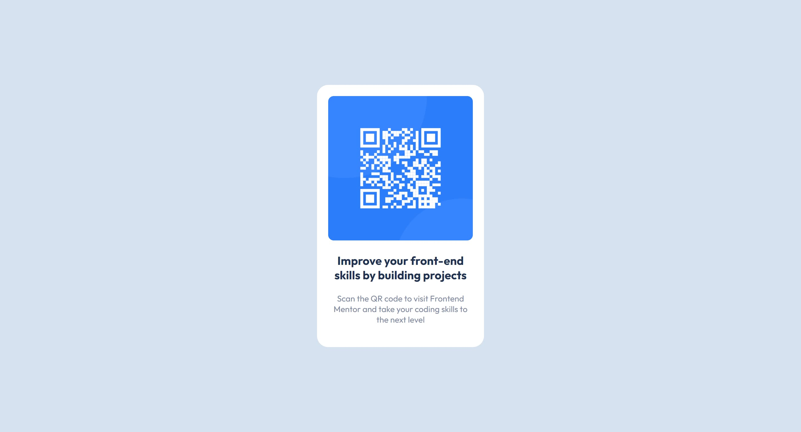

# Frontend Mentor - QR code component solution

This is a solution to the [QR code component challenge on Frontend Mentor](https://www.frontendmentor.io/challenges/qr-code-component-iux_sIO_H).

### Screenshot

### Links

- Live Site URL: [Click here](https://jamilpl.github.io/qr-code-component/)

### Built with

- HTML5
- CSS
- Flexbox

## Author

- Frontend Mentor - [@jamilpl](https://www.frontendmentor.io/profile/jamilpl)
